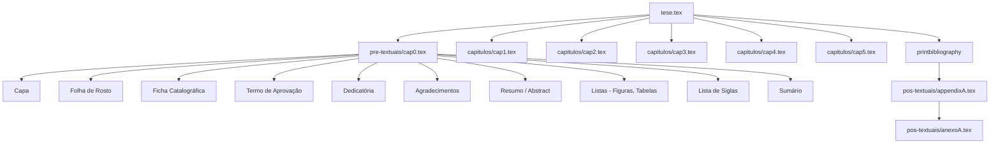

# Design Document

## Overview

This design describes the technical approach for migrating the TCC PARKON V3 document from PDF format into a LaTeX project using the PPGC-UFF-Latex-Abnt template. The migration produces a complete, compilable LaTeX project that preserves all original content while conforming to the ABNT-compliant template structure.

The migration is a one-time content transfer operation, not a reusable software system. The "Migration_System" is implemented as a series of manual and tool-assisted steps that produce LaTeX source files. The output is a set of `.tex` and `.bib` files organized according to the template's folder structure, compilable with MikTeX using the `pdflatex → biber → makeglossaries → pdflatex → pdflatex` pipeline.

### Key Design Decisions

1. **Preserve template as-is**: The PPGC_UFF.cls class file and biblatex-abnt support files are used without modification. All formatting comes from the class/template, not custom commands.
2. **UTF-8 throughout**: All generated `.tex` files use UTF-8 encoding with `\usepackage[utf8]{inputenc}`, allowing direct use of Portuguese characters without escape sequences.
3. **Content extraction approach**: Content is extracted from TCC_PARKON_V3.pdf by reading and transcribing text, then structuring it into LaTeX commands. Figures are extracted as image files (PNG).
4. **biblatex-abnt with biber**: Bibliography uses `biblatex` with `style=abnt` and `backend=biber`, matching the template configuration exactly.
5. **Sequential file naming**: Chapters use `cap1.tex` through `capN.tex`; appendices and annexes use `appendixA.tex`, `anexoA.tex`, etc.

## Architecture

The LaTeX project follows a modular file architecture dictated by the PPGC-UFF-Latex-Abnt template:

```
TCC-PARKON/
├── tese.tex                    # Main file (document root)
├── PPGC_UFF.cls               # Class file (from template, unchanged)
├── cvs-id.def                 # Class dependency (from template, unchanged)
├── bibliografia.bib           # All bibliographic references
├── biblatex-abnt/             # biblatex-abnt style files (from template)
│   ├── abnt.bbx
│   ├── abnt.cbx
│   └── ...
├── brazil-abnt.lbx            # Language support (from template)
├── brazilian-abnt.lbx         # Language support (from template)
├── pre-textuais/
│   ├── cap0.tex               # Cover, title page, approval, abstracts, lists
│   └── acronimos.tex          # Acronym definitions
├── capitulos/
│   ├── cap1.tex               # Chapter 1 - Introdução
│   ├── cap2.tex               # Chapter 2 - Referencial Teórico / Trabalhos Relacionados
│   ├── cap3.tex               # Chapter 3 - Metodologia / Proposta
│   ├── cap4.tex               # Chapter 4 - Resultados
│   ├── cap5.tex               # Chapter 5 - Conclusão
│   └── figuras/               # All figure files
│       ├── fig1.png
│       ├── fig2.png
│       └── ...
└── pos-textuais/
    ├── appendixA.tex          # Appendix A (if present)
    └── anexoA.tex             # Annex A (if present)
```

### Document Flow (Compilation Order)



## Components and Interfaces

### Component 1: Main File (tese.tex)

**Responsibility**: Document root that configures the document class, loads all packages, sets font configuration, and includes all component files in ABNT order.

**Interface**:
- Input: All `.tex` files via `\include` commands
- Input: `bibliografia.bib` via `\addbibresource`
- Input: `pre-textuais/acronimos.tex` via `\input` (before `\begin{document}`)
- Output: Compiled PDF

**Configuration details**:
- Document class: `\documentclass[ruledheader, 12pt, openright, a4paper, oneside, english, brazil]{PPGC_UFF}`
- Package load order follows template exactly (babel → fontenc → inputenc → graphics → symbols → math → algorithm → utilities → glossaries → hyperref → biblatex)
- Font: ptm (Times) with bold series for chapter/section headers
- Figure/table counter: `\counterwithout{figure}{chapter}` and `\counterwithout{table}{chapter}`

### Component 2: Pre-Textual Elements (pre-textuais/cap0.tex)

**Responsibility**: Defines all front matter using PPGC_UFF class commands.

**Interface**:
- Commands: `\autor{}`, `\titulo{}`, `\instituicao{}`, `\orientador{}`, `\coorientador{}`, `\local{}`, `\data{}`, `\comentario{}`
- Environments: `\capa`, `\folhaderosto`, `resumo`, `abstract`
- Special commands: `\pretextualchapter{Agradecimentos}`
- Lists: `\listoffigures`, `\listoftables`, `\tableofcontents`
- Glossary: `\printglossary[type=\acronymtype,title={Lista de Abreviaturas e Siglas}]`

**Page numbering**: Roman numerals (`\pagenumbering{roman}`) starting at page 1 after `\folhaderosto`.

### Component 3: Chapter Files (capitulos/capN.tex)

**Responsibility**: Each file contains one chapter as a LaTeX fragment (no preamble, no `\documentclass`).

**Interface**:
- Starts with `\chapter{Title}` followed by `\label{cap:identifier}`
- Uses `\section{}`, `\subsection{}`, `\subsubsection{}` for heading hierarchy
- References bibliography via `\cite{}` and `\textcite{}`
- References figures/tables via `\autoref{}`
- Uses `\acrfull{}` for first acronym use, `\acrshort{}` for subsequent uses

### Component 4: Acronym Definitions (pre-textuais/acronimos.tex)

**Responsibility**: Defines all acronyms using the glossaries package.

**Interface**:
- One `\newacronym{label}{SHORT}{Long Form}` per acronym
- Loaded via `\input{pre-textuais/acronimos}` in preamble (before `\begin{document}`)

### Component 5: Bibliography (bibliografia.bib)

**Responsibility**: Contains all bibliographic references in BibTeX format compatible with biblatex-abnt.

**Interface**:
- Entry types: `@article`, `@book`, `@inproceedings`, `@phdthesis`, `@mastersthesis`, `@techreport`, `@online`, `@misc`
- Key format: `{firstAuthorLastName}{year}` (e.g., `silva2020`)
- Duplicate keys resolved with letter suffix: `silva2020a`, `silva2020b`
- Referenced in main file via `\addbibresource{bibliografia.bib}`

### Component 6: Post-Textual Elements (pos-textuais/)

**Responsibility**: Appendices and annexes, each in a separate file.

**Interface**:
- Appendix files start with `\chapter{APÊNDICE X – Title}`
- Annex files start with `\chapter{ANEXO X – Title}`
- Included after `\appendix` command in main file
- Appendices come before annexes in inclusion order

## Data Models

### BibTeX Entry Structure

Each bibliographic reference maps to a BibTeX entry with the following schema:

| Field | Required | Description |
|-------|----------|-------------|
| author | Yes | Author names in "Lastname, Firstname and ..." format |
| title | Yes | Work title |
| year | Yes | Publication year |
| journal | @article | Journal name |
| booktitle | @inproceedings | Conference/proceedings name |
| volume | Optional | Volume number |
| number | Optional | Issue number |
| pages | Optional | Page range (e.g., "1--15") |
| publisher | Optional | Publisher name |
| school | @phdthesis/@mastersthesis | Institution name |
| doi | Optional | DOI identifier |
| url | Optional | URL for online resources |
| note | Optional | Additional notes, access dates |

### Acronym Entry Structure

Each acronym follows:
```latex
\newacronym{<label>}{<abbreviation>}{<full form>}
```

Where:
- `label`: lowercase identifier used in `\acrfull{}` and `\acrshort{}` commands (e.g., `iot`)
- `abbreviation`: the short form displayed in text (e.g., `IoT`)
- `full form`: the expanded text (e.g., `Internet of Things`)

### Cross-Reference Label Convention

| Element | Label Format | Example |
|---------|-------------|---------|
| Chapter | `cap:identifier` | `cap:introducao` |
| Section | `sec:identifier` | `sec:metodologia` |
| Figure | `fig:identifier` | `fig:arquitetura` |
| Table | `tab:identifier` | `tab:resultados` |
| Equation | `eq:identifier` | `eq:formula1` |
| Algorithm | `alg:identifier` | `alg:busca` |
| Appendix | `apend:identifier` | `apend:questionario` |
| Annex | `anexo:identifier` | `anexo:dados` |

### Citation Command Mapping

| Source Document Pattern | LaTeX Command |
|------------------------|---------------|
| (Author, Year) at end of sentence | `\cite{key}` |
| Author (Year) as part of sentence | `\textcite{key}` |
| [Number] reference style | `\cite{key}` |
| Multiple references grouped | `\cite{key1, key2, key3}` |
| Citation with page number | `\cite[p.XX]{key}` |

## Error Handling

### Content Extraction Failures

When content cannot be extracted or represented in LaTeX:

```latex
% TODO: [MIGRATION] Content could not be extracted from source PDF.
% Location: Page X, Section "Title"
% Description: <what content is missing>
% Action required: Manual transcription needed
```

### Unresolved Citations

When a citation cannot be matched to a bibliography entry:

```latex
% TODO: [CITATION] Unresolved citation - original text: "Author (Year)"
\cite{MISSING_authorYear}
```

In `bibliografia.bib`:
```bibtex
% TODO: [MISSING FIELDS] Entry below is missing: <field list>
@misc{key,
  author = {Available Author},
  title = {Available Title},
  year = {0000},
}
```

### Missing Figures

When a figure cannot be extracted as an image file:

```latex
\begin{figure}[!ht]
   \centering
   % TODO: [FIGURE] Image file not available. Original caption below.
   % Source: TCC_PARKON_V3.pdf, Page X
   \fbox{\parbox{0.8\linewidth}{\centering\textbf{[Figura não disponível]}\\Original caption text here}}
   \caption{Original caption text}
   \label{fig:identifier}
\end{figure>
```

### Unresolved Cross-References

When an internal reference cannot be matched:

```latex
% TODO: [REF] Unresolved cross-reference. Original text: "Figura X"
\ref{UNDEFINED_figX}
```

### Compilation Error Prevention

- All `\include` paths are verified to match actual file names
- All `\label` identifiers are unique across the project
- All `\cite` keys have a corresponding entry in `bibliografia.bib`
- Package load order follows the exact template sequence to prevent conflicts

## Testing Strategy

### Why Property-Based Testing Does Not Apply

This feature is a one-time document migration — it produces static LaTeX files from a fixed source PDF. There are no reusable pure functions with varied inputs, no algorithmic logic to validate across input ranges, and no programmatic transformation that benefits from randomized testing. The acceptance criteria are about content preservation and template conformance, which are verified through compilation and manual review.

### Verification Approach

The testing strategy uses a **compilation-based verification** approach combined with **manual content review**:

#### 1. Compilation Test (Automated)

**Purpose**: Verify the LaTeX project compiles without errors.

**Process**:
```
pdflatex tese.tex
biber tese
makeglossaries tese
pdflatex tese.tex
pdflatex tese.tex
```

**Pass criteria**: Zero errors in log output (warnings acceptable).

**Validates**: Requirements 8.4 (compilation success), 8.1-8.5 (package configuration), 2.7 (no missing dependencies)

#### 2. Structure Verification (Manual Checklist)

| Check | Requirement |
|-------|------------|
| tese.tex uses `PPGC_UFF` class with correct options | 2.1 |
| Pre-textual files exist in `pre-textuais/` | 2.2 |
| Each chapter has its own file in `capitulos/` | 2.3 |
| Post-textual files exist in `pos-textuais/` | 2.4 |
| Include order: pre-textual → chapters → bibliography → post-textual | 2.5 |
| `bibliografia.bib` exists and is referenced via `\addbibresource` | 2.6 |
| Class file and support files in project root | 2.7 |

#### 3. Content Fidelity Review (Manual Comparison)

**Process**: Side-by-side comparison of compiled PDF output against TCC_PARKON_V3.pdf.

**Checks**:
- All body text paragraphs present and unaltered (Req 1.1)
- All section/subsection titles match exactly (Req 1.2)
- All figure captions, table captions, and footnotes match (Req 1.3)
- All bibliographic entries present with correct fields (Req 1.4)
- Special characters and diacritics render correctly (Req 1.6)
- TODO comments mark any unresolvable content (Req 1.5)

#### 4. Pre-Textual Elements Review (Manual)

- Cover page data matches source (Req 3.1-3.3)
- Approval page contains all banca members (Req 3.4)
- Resumo/Abstract with keywords present (Req 3.5-3.6)
- Dedication and acknowledgments present if in source (Req 3.7-3.8)

#### 5. Citation and Bibliography Verification (Semi-automated)

**Process**: Run `biber` and check for warnings about undefined citations or unused entries.

**Checks**:
- No undefined citation warnings (Req 6.6)
- All `\cite` and `\textcite` commands resolve (Req 4.5-4.6)
- MISSING_ placeholders documented for unresolved citations (Req 4.7)
- Reference list renders with ABNT formatting (Req 6.4-6.5)

#### 6. Cross-Reference Verification (Semi-automated)

**Process**: Run `pdflatex` twice and check for undefined reference warnings.

**Checks**:
- No "undefined reference" warnings for resolved refs (Req 9.1)
- UNDEFINED_ placeholders documented for unresolved refs (Req 9.2)
- Table of contents, list of figures, list of tables generated (Req 9.3)
- Page numbering: roman for pre-textual, arabic for textual (Req 9.4)

#### 7. Acronym Verification (Semi-automated)

**Process**: Run `makeglossaries` and verify output.

**Checks**:
- Abbreviation list generates without errors (Req 7.3)
- First occurrence uses `\acrfull`, subsequent uses `\acrshort` (Req 7.2)
- All acronyms from source document are defined (Req 7.1)
